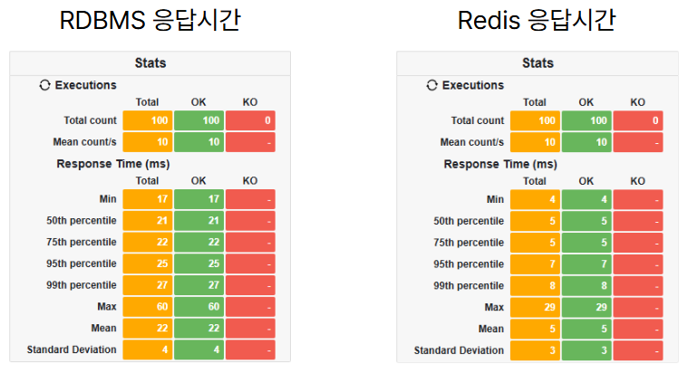

# Ticket Reservation System

티켓 예매 시스템으로, 예매 처리 성능을 향상시키는 것을 목적으로 해당 서비스에 적절한 방법을 탐색 및 비교하는 서비스입니다. 두 가지 방식으로 성능을 비교하여 최적화 방향을 찾고 있습니다.

---

## 브랜치 설명

- **RDBMS**: RDBMS에서 비관적 락(Pessimistic Locking)을 활용한 동시성 처리 방법을 구현합니다.
- **Redis**: Redis 큐를 활용한 동시성 처리 방법을 구현합니다.

---

## 테스트 결과 비교

### 테스트 환경

- **서버 사양**: CPU, 메모리, 네트워크 속도 등
- **데이터베이스 환경**: RDBMS, Redis
- **부하 발생 툴**: Gatling을 사용하여 동시 접속자 수와 요청량을 조정하며 테스트

---

### 성능 지표

- **요청 처리 시간**: 요청이 처리되는 데 걸린 평균 시간

---

### 시나리오별 Gatling 테스트 결과

#### 첫번째 시나리오
- 사용자 100명이 서로 다른 좌석 100개 요청

    

#### 두번째 시나리오
- 사용자 100명이 하나의 좌석 100개 요청

    

---

### 결과 분석

#### 응답 시간

Redis는 모든 퍼센타일에서 RDBMS보다 현저히 낮은 응답 시간을 기록했습니다.

**첫번째 시나리오**
- **Redis**:
  - 50th percentile: 5 ms
  - 75th percentile: 5 ms
  - 95th percentile: 7 ms
  - 99th percentile: 8 ms
- **RDBMS**:
  - 50th percentile: 21 ms
  - 75th percentile: 22 ms
  - 95th percentile: 25 ms
  - 99th percentile: 27 ms

**두번째 시나리오**
- **Redis**:
  - 50th percentile: 5 ms
  - 75th percentile: 7 ms
  - 95th percentile: 8 ms
  - 99th percentile: 9 ms
- **RDBMS**:
  - 50th percentile: 18 ms
  - 75th percentile: 20 ms
  - 95th percentile: 28 ms
  - 99th percentile: 281 ms

**요약**:
- 첫번째 시나리오: Redis의 평균 응답 시간은 5 ms로, RDBMS의 22 ms보다 월등히 낮습니다.
- 두번째 시나리오: Redis의 평균 응답 시간은 6 ms로, RDBMS의 26 ms보다 월등히 낮습니다.

#### 시스템 안정성

두 시스템 모두 요청 성공률은 100%로 동일하지만, Redis의 응답 시간이 전반적으로 낮은 점은 성능 안정성 측면에서 Redis가 더 우수하다는 것을 의미합니다.

#### 사용자 경험

빠른 응답 시간은 사용자 경험에 긍정적인 영향을 미치며, 특히 대량의 요청이 발생할 때 Redis의 성능이 더욱 두드러질 것입니다. 이는 실시간 예약 시스템과 같이 높은 동시성이 요구되는 경우에 매우 중요합니다.

---

### 결과 요약
- **RDBMS 방식**: 동시 요청 수가 증가할수록 락 경합으로 인해 성능이 저하되었습니다.
- **Redis 방식**: 높은 동시성 환경에서도 안정적으로 작동하며, 처리 시간이 상대적으로 짧고 에러율이 낮았습니다.

두 방식을 비교하여 **Redis 기반 동시성 처리 방식**이 고부하 환경에서 더 적합하다는 결론을 얻을 수 있었습니다.

---

### Gatling 차트(RDBMS, Redis)

#### RDBMS
- [First scenario Details Report](./images/rdbms_simulation_test1_details.pdf)
- [Second scenario Details Report](./images/rdbms_simulation_test2_details.pdf)
  
#### Redis
- [First scenario Details Report](./images/redis_simulation_test1_details.pdf)
- [Second scenario Details Report](./images/redis_simulation_test2_details.pdf)

---